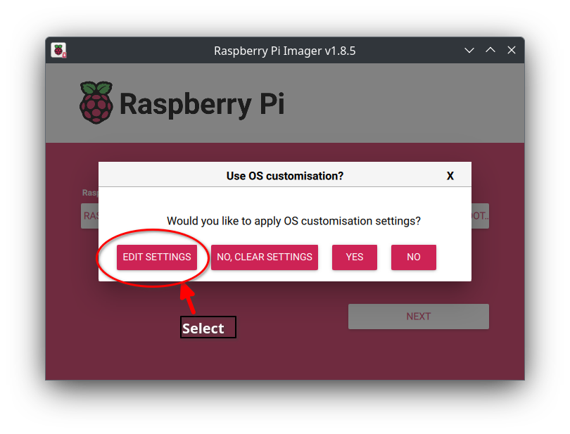

# Install Home Assistant on Raspberry Pi 4 (Using Docker)

This guide provides step-by-step instructions for setting up Home Assistant on a Raspberry Pi 4 Model B using a 128GB USB stick and Docker.

## Prerequisites

- Raspberry Pi 4 Model B
- 128GB USB stick
- Power supply for Raspberry Pi
- Network connection (Wi-Fi or Ethernet)
- Computer for initial setup

## 1. Prepare the Raspberry Pi OS

1. Download and install [Raspberry Pi Imager](https://www.raspberrypi.com/software/)
2. Insert the 128GB USB stick into your computer
3. Open Raspberry Pi Imager and configure:

   - **Choose Raspberry Pi Device**: Select "Raspberry Pi 4"
    <div style="text-align: left; padding: 25px">
        <strong>Raspberry Pi 4</strong><br/>
        <a href="../../assets/images/RPI_IMAGER/Screenshot_20241229_210249.png" target="_blank">
            
        </a>
   </div>

   - **Choose OS**: Select "Raspberry Pi OS Lite (64-bit)"

   <div style="text-align: left; padding: 25px">
       <strong>Step 1 - Raspberry Pi OS (other)</strong><br/>
       <a href="../../assets/images/RPI_IMAGER/Screenshot_20241229_210909.png" target="_blank">
           
       </a>
       <br/><br/>
       <strong>Step 2 - Raspberry Pi OS Lite (64-bit)</strong><br/>
       <a href="../../assets/images/RPI_IMAGER/Screenshot_20241229_211039.png" target="_blank">
           
       </a>
   </div>
    
   - **Choose Storage**: Select your 128GB USB stick
   <div style="text-align: left; padding: 25px">
       <strong>Step 1 - Select Storage</strong><br/>
       <a href="../../assets/images/RPI_IMAGER/Screenshot_20241229_211442.png" target="_blank">
           
       </a>
       <br/><br/>
       <strong>Step 2 - Select Samsung Flash Drive</strong><br/>
       <a href="../../assets/images/RPI_IMAGER/Screenshot_20241229_211529.png" target="_blank">
           
       </a>
   </div>

   - Click the Next Button:
     <div style="text-align: left; padding: 25px">
          <a href="../../assets/images/RPI_IMAGER/Screenshot_20241229_211634.png" target="_blank">
              
          </a>
     </div>

   - Choose Edit Settings:
   <div style="text-align: left; padding: 25px">
        <a href="../../assets/images/RPI_IMAGER/Screenshot_20241229_21725.png" target="_blank">
            
        </a>
   </div>

4. OS Customization - General
      <div style="text-align: left; padding: 25px">
        <a href="../../assets/images/RPI_IMAGER/Screenshot_20241229_212116.png" target="_blank">
            
        </a>
   </div>

   - Step 1 - Hostname: `homeassistantpi` (or any name you want)
   - Step 2 - Add your user name and password
   - Step 3 - Set your wireless network SSID and Passkey
   - Step 4 - Set your timezone

    <br/>

5. OS Customization - Services
     <div style="text-align: left; padding: 25px">
        <a href="../../assets/images/RPI_IMAGER/Screenshot_20241229_212447.png" target="_blank">
            
        </a>
        <br/><br/>
        <a href="../../assets/images/RPI_IMAGER/Screenshot_20241229_212750.png" target="_blank">
            
        </a>
        <br/><br/>
        <a href="../../assets/images/RPI_IMAGER/Screenshot_20241229_212010.png" target="_blank">
            
        </a>
   </div>

6. **Write** to the USB stick and wait for completion
<div style="text-align: left; padding: 25px">
    <a href="../../assets/images/RPI_IMAGER/Screenshot_20241229_213026.png" target="_blank">
        
    </a>
    <br/><br/>
    <a href="../../assets/images/RPI_IMAGER/Screenshot_20241229_213204.png" target="_blank">
        
    </a>
</div>

7. Remove the USB stick from your computer and insert it into your Raspberry Pi 4. Choose one of the USB ports in the middle (blue) since they are USB 3.0.

8. Plug the Conbee III into the other blue USB port on the Raspberry Pi 4.

9. Power on the Pi. It may take a few minutes to expand the disk upon the first start up. Wait about 3 to 5 minutes. If you can't ssh into the Raspberry Pi in the next step after waiting then unplug the Raspberry Pi. Wait 10 seconds and plug it back it. The Raspberry Pi should now be connected to your local network.

## 2. Connect to the Raspberry Pi

1. Using the host name you used above for the Raspberry Pi
2. Open a terminal window and SSH into the Pi:

```bash
# Change to the username and hostname you used above
ssh pi@homeassistantpi.local
# Or use the IP address:
ssh pi@<Raspberry_Pi_IP>
```

## 3. Update the System

Update and upgrade all packages:

```bash
sudo apt update && sudo apt upgrade -y && sudo apt autoremove -y
```

## 4. Install Docker

1. Install Docker using the official script:

```bash
curl -fsSL https://get.docker.com | sh
```

2. Add your user to the Docker group:

```bash
sudo usermod -aG docker $USER
```

3. Log out and back in for changes to take effect:

```bash
logout
```

4. SSH back into the Raspberry Pi

```bash
# Change to the username and hostname you used above
ssh pi@homeassistantpi.local
# Or use the IP address:
ssh pi@<Raspberry_Pi_IP>
```

## 5. Prepare Home Assistant

1. Move into the Documents folder:

```bash
mkdir ~/Documents
cd ~/Documents
```

2. Pull the Docker Compose file down.

```bash
curl -O https://www.timothysayre.com/assets/code/compose.yml
```

3. Discover where the Conbee III is attached:

```bash
ls -lah /dev/serial/by-id
```

<div style="text-align: left; padding: 25px">
    <a href="../../assets/images/Screenshot_20241229_235624.png" target="_blank">
        
    </a>
</div>

- Take note of the assigned port at the end of the listing on your system. It may be different for your system.

4. Edit/Update the compose file with your serial port id:

```bash
nano compose.yml
```

<div style="text-align: left; padding: 25px">
    <a href="../../assets/images/Screenshot_20241230_001922.png" target="_blank">
        
    </a>
</div>

- Step 1 - Change to your serial port id (two places with a colon in the middle).
- Step 2 - Change to your time-zone. (America/New_York or America/Chicago)
- Step 3 - Ctrl-S and Ctrl-X to save the changes and quit the editor.

## 6. Run Home Assistant

Start the Home Assistant container:

```bash
docker compose up -d
```

- This will take several minutes to pull the images down and spin up the containers

## 7. Access Home Assistant

1. Wait approximately 2-3 minutes for initialization
2. Open a web browser and navigate to :
   - `http://<your_host0name>:8123` or
   - `http://<Raspberry_Pi_IP>:8123`
3. Click on the 'CREATE MY SMART HOME' button and complete the setup wizard to create your admin account

<div style="text-align: left; padding: 25px">
    <strong>Verify the Zigbee dongle is found after completing the wizard</strong><br/>
    <a href="../../assets/images/Screenshot_20241230_004302.png" target="_blank">
        
    </a>
</div>

## 8. Verify Auto-Restart

Test that Home Assistant automatically restarts after a system reboot:

1. Reboot the Raspberry Pi:

```bash
sudo reboot
```

2. Wait for the system to restart, then try to access the dashboard in your browser tab:

## 9. To add devices and automations follow this video starting at 7 minutes in.

```bash
https://youtu.be/gJFsZL5CTgM?si=0vrqfrrt57d3YO-w
```

## 10. Install the Heatsink Kit on Raspberry Pi 4

<div style="text-align: left; padding: 50px">
    <strong>Three installed on top</strong><br/>
    <a href="../../assets/images/RPiHeatSink_0.jpg" target="_blank">
        
    </a>
    <br/><br/>
    <strong>One installed on bottom</strong><br/>
    <a href="../../assets/images/RPiHeatSink_1.jpg" target="_blank">
        
    </a>
</div>

## Troubleshooting

- If `homeassistantpi.local` doesn't resolve, use the IP address instead
- Allow a few minutes for Home Assistant to fully initialize on first run
- Check Docker logs if needed: `docker logs homeassistant`

---

You now have Home Assistant running on your Raspberry Pi 4 with automatic restarts and persistent configuration!
